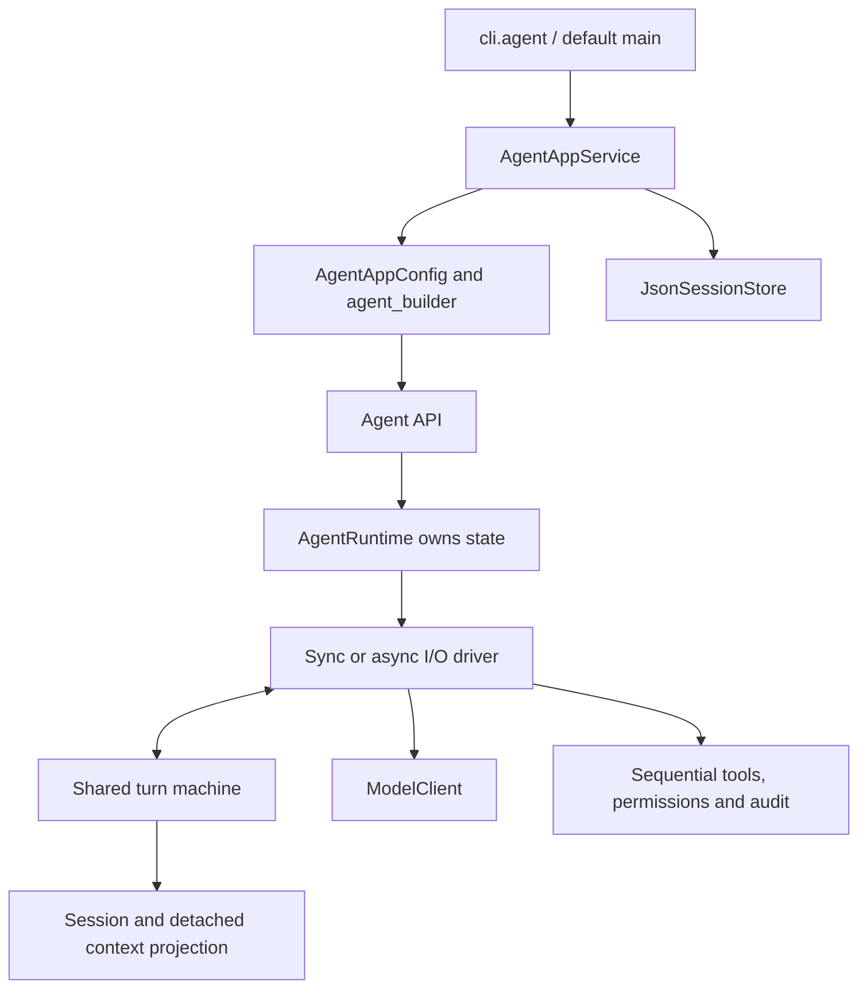

# Agent execution and extension boundaries

The standalone path is `cli.agent` → `AgentAppService` → neutral configuration
and factory → `Agent` → `AgentRuntime`. Runtime owns its model, session, frozen
options, executor, event hub and run state. It never points back to the facade.



## Existing APIs

`run` and `arun` return final text. `run_stream` and `arun_stream` yield
`models.Chunk` values. They now share one turn machine, including message
recording, sequential tools, explicit terminal-tool outcomes, and iteration limits.
All four APIs record and return or stream an iteration-limit notice when the
run exhausts its turn budget, with a final `max_turns` event status.

Different Agent instances can run concurrently. Overlapping runs on **the same Agent**
raise `core.agent_runtime.AgentBusyError` before changing its session. Public replacement of the session, registry, model, options or system prompt
is rejected during a run. Application save/load and new-session operations are
also gated. Direct mutation of exposed nested low-level objects is unsupported.

`add_system_prompt_extension(text)` appends trusted fixed instructions and returns
an opaque handle; `remove_system_prompt_extension(handle)` removes only that
layer. Both require idle ownership. Extensions compose with the configured role
or active inherited system instructions and survive base-prompt rebuilds and
context compaction. They remain part of the fixed token budget. Source messages
and task content must not be passed as system extensions.

Base configuration remains separate from these layers. Replacing a session
restores the old session's base and applies current extensions to the new one.
Only active system messages provide an inherited base when a session is attached;
audit-only instructions are never reactivated. An Agent captures this base for
later explicit resets. Extension handles are in-memory ownership, not serialized
configuration: restore application bindings explicitly when resuming a session.

`AgentWorker(..., system_prompt_extension=text)` owns one extension for its whole
binding and removes it before releasing the Agent, after actual execution stops.
Group uses this generic facility; the standalone Agent has no Group-specific rules.

## Observing execution

Given an existing agent, subscribe without changing its normal return value:

```python
from core.agent_runtime import AgentEvent

def observe(event: AgentEvent) -> None:
    if event.type == "run_end":
        print(event.run_id, event.status)

unsubscribe = agent.subscribe(observe)
try:
    result = agent.run("Inspect the workspace")
finally:
    unsubscribe()  # Safe to call more than once.
```

Listeners are synchronous and execute on the caller's thread/task. Keep them
short; forward events to your own queue for asynchronous processing. Ordinary
listener exceptions are logged and do not abort the run. Each listener receives
its own deep copy, so editing an event's nested message or chunk cannot edit
the session or another listener's event. This is payload isolation, not a
sandbox for callback code. A callback must not start another run on the same
agent, including from `run_end`.

All events have `type`, `run_id`, and `turn` (zero before the first turn).
Optional fields are populated according to the event:

| Event | Meaning / payload |
| --- | --- |
| `run_start` | Run guard acquired, before adding the input |
| `turn_start` | A new model/tool cycle begins |
| `message_delta` | A streaming `chunk` with content, reasoning, tool calls, or a finish signal |
| `message_end` | A completed assistant or tool `message` committed to Session |
| `tool_start` | A `tool_call` is about to be requested |
| `tool_end` | Its result is committed; includes `tool_call` and `message` |
| `turn_end` | The normal cycle completed |
| `context_compaction_start` | Context maintenance begins; `context` contains reason and input estimate |
| `context_compaction_end` | Validated view committed, or no change needed; `context` contains outcome |
| `context_compaction_failed` | Candidate rejected; `context` and `error` describe the failure |
| `run_end` | Terminal `status`, `result`, and optional `error` |

Terminal statuses are `completed`, `tool_stop`, `max_turns`, `error`, `timeout`,
`cancelled`, and `closed`. Errors, timeouts, cancellation, and explicit close
still notify subscribers of `run_end`; exceptions propagate to the caller.
A rejected overlapping run emits no events. An interrupted turn need not have
`turn_end` or matching `tool_end` events.

For a consumer that drives execution directly, use
`agent.run_events(message, stream=False)` or
`agent.arun_events(message, stream=False)`. Both yield `AgentEvent`; `stream=True`
also exposes deltas. These are lazy execution APIs, not subscriptions to a
background task. Advancing the iterator advances the run. Exhaust or explicitly
close it, especially when breaking early:

```python
from contextlib import aclosing

async with aclosing(agent.arun_events("Inspect the workspace", stream=True)) as events:
    async for event in events:
        if event.chunk is not None:
            print(event.chunk.message, end="")
```

Use `contextlib.closing` for synchronous iterators. The same rule applies to
the existing chunk streaming APIs. Consume and close an async stream in the
same task when the provider manages task-local context. Once an iterator is
closed or raises, cleanup events are delivered to subscribers rather than
yielded from that iterator. Events are in-memory observations, not a persisted
or replayable execution log.

## Preparing model context

The runtime estimates the complete provider-visible request before each call,
including transformed messages, tool schemas, arguments and framing. Capacity
comes from `AgentOptions(context_window=...)` or trusted injected model metadata;
an unknown capacity blocks inference. `context_input_limit` optionally caps input
below the window after output and safety reserves. The default estimate counts
UTF-8 bytes conservatively and identifies its counting method. An injected
`token_counter` can provide model-specific tokenization.

At the soft threshold, the shared turn machine summarizes older complete units
or replaces oversized tool-result bodies with archived previews. It preserves
the latest user request, system instructions and assistant/tool pairing. Each
compaction uses at most four bounded, non-streaming model calls. Summaries are
historical assistant content, not system instructions. Detached candidates must
be valid, smaller and within budget; originals are archived before the new view
is committed against the expected session revision. Errors, cancellation or a
stale revision leave the previous view intact. Completed tool effects remain
recorded and are never replayed by compaction.

Use `agent.context_status()`, `agent.compact(focus='')` or
`await agent.acompact(focus='')` while idle. Compaction uses the same ownership
guard and deadline as a run. Short requests below the threshold add no summary
network calls. Typed provider overflows allow one recovery attempt before any
visible streamed output; there is no generic error retry. Protected input that
cannot fit raises an error rather than dropping or truncating messages.

Pass a synchronous `context_transform` when constructing an Agent:

```python
from core.agent import Agent
from models import Message, System

def project(messages: list[Message]) -> list[Message]:
    messages.insert(0, System("Give concise answers."))
    return messages

agent = Agent(existing_llm, context_transform=project)
```

Before **each** model request, the runtime copies `session.working_messages()`, applies the
transform, validates that it returns a list of `Message`, and copies the result
again. A provider or transform cannot mutate stored history through that list.
The transform sees the current tool results on later turns. The final transformed
projection and tool schemas are the same detached snapshot counted and sent.

This remains a seam for request-specific projection and instructions. The
transform itself does not edit stored originals or checkpoints. Preserve
provider-valid assistant/tool call pairs and required
system instructions when filtering. Transform errors fail the run and release
its guard.

Each model request also reads the current tool schemas. A tool registered
between turns is available on the next request. Permission checks and audit
records continue to use the existing tool runtime.

## Model and internal runtime ports

`core.agent_runtime.ModelClient` describes the existing provider surface:
`invoke`, `ainvoke`, `stream`, and `astream`. Non-streaming responses keep the
existing OpenAI-compatible dictionary shape; streaming uses `models.Chunk`.
`LLMClient` needs no inheritance or wrapper. A replacement provider should
implement the methods needed by its callers, including existing usage/config
capabilities if application views consume them.

The HTTP adapter rejects malformed/error SSE events and requires a provider
finish reason before exposing completed tool calls. Non-streaming HTTP replies
also require a nonempty string finish reason for each returned choice; missing,
null, blank or non-string values raise `LLMError` before the response is returned
to the runtime. Reported usage remains accounted for even when validation fails.
Token-limit, filtering,
error and abort finish reasons raise `LLMError` before response commit in both
streaming and non-streaming runs. Custom model adapters may omit finish metadata
for complete responses, but must raise on incomplete output themselves; the
runtime also checks finish reasons when supplied. Finish-only chunks are
preserved by the public stream adapters.

`AgentRuntimePort` describes capabilities used by the turn machine and drivers.
It is an internal boundary, not a complete plugin API.
`AgentRuntime` implements it directly; `AgentRuntimeAdapter` was removed.
Keep application wiring in `application/`; the core has no reverse dependency.

## Deadlines and interrupted tools

Async model I/O has a cooperative overall deadline and runs in the calling
task, including on Python 3.10. This preserves provider `ContextVar` scopes
across streaming chunks. Once the deadline cancels model I/O, its in-place
unwinding has a 250 ms cooperative grace period followed by one further
cancellation. A separate stream `aclose()` also has its own 250 ms window, so
these are not a single universal elapsed-time cap. Timers and owned cancellation
counts are removed on exit; external cancellation retains its identity where
the Python runtime/provider exposes it. Python 3.10 has no cancellation counts.
Cancellation-resistant provider code and blocking synchronous code cannot be
forcibly preempted; the Agent remains busy until the original operation exits.
No background provider task is abandoned. Without an overall deadline, this
does not add a watchdog around arbitrary external cancellation.

If stream cleanup also fails while propagating an execution error, the original
error wins and cleanup failure is logged. Cleanup-only failures still propagate.

Tools still execute sequentially on the caller thread. Completed tool results
are committed before checking the deadline. If execution stops after recording
an assistant tool-call batch, remaining calls receive explicit
`[ToolCallInterrupted]` result records. These balance the provider transcript;
they do not execute or retry tools, and they do not claim a side effect failed.
Check external state before retrying work whose outcome is unknown.

## Application lifecycle and idle snapshots

`AgentAppService` provides `run`, `arun`, `run_stream`, `arun_stream`,
`context_status`, `compact`, `acompact`, `new_session`, `save_session(path)`,
`load_session(path)`, usage and audit views.
It owns factory-created models and closes them with `aclose()` or `async with`.
Injected models are borrowed unless `owns_model=True`. Use one event loop for
an application's async lifetime; the CLI does so and closes resources in
`finally`. Exhaust or explicitly close streams before closing the service.
Raw Agent model replacement does not transfer application ownership: the
service closes the original composed model; raw lifecycle is caller-managed.
Concurrent close callers share a shielded cleanup task. A cancelled waiter can
await `aclose()` again while the event loop remains alive. Cleanup failure is
reported and leaves a retryable `close_failed` state with runs blocked; a model
must itself support retrying failed cleanup.

`JsonSessionStore` writes schema version 2. It preserves session and entry
identities, revision, history and active references, checkpoints, preview
overrides and archive links, along with history limits, reasoning, tool IDs,
and dict versus string arguments. It can import version 1 while preserving
ambiguous repeated messages as distinct entries. Imported snapshots are marked
as potentially incomplete because old pruning cannot be reversed.
Message variants are System, User, AI, Reasoning, standalone ToolCall,
and tool-result Message. Streaming Chunk values are not session records.
Unknown fields/types/versions, malformed JSON, duplicate JSON keys, incomplete
batches and unmatched results fail validation. IDs may recur in later completed
batches. The provider context gate and snapshot codec share tool-pair validation.

Saving validates first, writes a private (0600) same-directory temporary file,
flushes/fsyncs it and atomically replaces the target; failures remove the temp
and retain the previous target. This is not a power-loss durability guarantee.
Both snapshot operations require an idle, open service and an idle Agent;
locks cover admission through serialization/replacement. Failed load preserves
the existing Session object. Store load preserves snapshot data; application
load replaces active system instructions with the application's current prompt
while keeping historical instructions for audit. `/new` restores configured
history limits and the current prompt. Loading never invokes a model or tool.
The application reconnects the configured archive store after load and retains
it for new sessions. Missing attachments permit inspection and saving but block
inference until the files are restored.

Direct runtime construction supplies `archive_store=FileContextArchive(path)`
to `Agent`, or attaches it to the injected `Session`. The core does not choose
an environment-dependent path. Original entries receive stable identities;
bounded history caching archives entries before removing their last raw copy.
Without a store, the runtime refuses operations that would lose originals.
The reserved `read_context_archive` tool is bound when an archive-backed session
is installed. It follows the current session, rejects registration collisions,
accepts opaque archive IDs and character cursors, and returns at most 12000
content characters with a continuation cursor. Registry replacement retains
the owning Agent's archive binding. Archive retrieval has `read_only` metadata.

Snapshots contain conversation data and recorded tool-result outcome flags
(`tool_success`, `ends_run`), not provider secrets, ownership flags,
usage/audit logs or tool registrations. They do not
save an in-flight generator or authorize automatic effect replay. Usage-only
stream chunks preserve provider usage and effective model identity. Set
`stream_usage=True` on `LLMClient` to request streamed usage from a compatible
provider; it is opt-in because endpoint support varies. Missing usage remains
unknown, including summary calls, rather than becoming measured zero.
Partial usage remains available as response metadata; billing records require
all three primary token counts. Incomplete records increase the provider's
usage-collection error counter instead of inventing missing counts.
Consequently `/usage` totals exclude incomplete reports and may cover fewer
requests than were sent. Cumulative summary counts remain unknown for any field
missing from one or more summary responses.

## Migration and design references

- Explicit `LLMClient(...)` construction uses only supplied settings. Use
  `LLMClient.from_env()` to deliberately load application environment defaults.
  Explicit empty configuration no longer falls back to environment credentials.
- Tools use an immutable `tools.workspace.Workspace`, injected through
  `ToolRuntime` and `Agent(..., tool_runtime=...)`. The application builds this
  complete dependency before creating the Agent. Workspace paths and settings
  remain stable if process environment/cwd later change. Direct tool callers
  should use `workspace_context`; see [configuration](configuration.md).
- Use `application.agent_config.AgentAppConfig` and
  `application.agent_builder.build_agent` for application composition.
  `main.py` and `python -m cli.agent` run the same standalone CLI.
- Use explicit `AgentRuntime` composition or the `Agent` API.
  `AgentOptions` carries per-instance model and turn parameters.
- Applications customize prompts with ordinary named modules.
- Tool names have no termination authority. Register a successful terminal
  tool with `registry.register(tool, ends_run=True)`. The local policy stops
  after the entire batch is recorded if **any** registered terminal tool
  succeeds. Unknown tools, denied calls and failures do not stop the loop.
  Builtin failures use `tools.ToolFailure`, a text-compatible typed result;
  custom tools can return it or raise an exception. Error-like text alone is
  not interpreted as failure. Register tool names normally and pass the
  dispatch identifier positionally to `registry.call(name, **arguments)`.

| Reference | Adopted boundary | Deliberate local choice |
| --- | --- | --- |
| [Pi agent core at 898ab80](https://github.com/earendil-works/pi/tree/898ab804050730e9dcefb4443875d5a932aa6a32/packages/agent) | Shared turn policy, events and per-request context projection; explicit outcome metadata | Python, four model modes, serial tools, any-successful-terminal policy. Pi defaults to parallel tools and its documented terminate hint requires every finalized result to be terminal. |
| [Pi package separation](https://github.com/earendil-works/pi/tree/898ab804050730e9dcefb4443875d5a932aa6a32) | Model interface, execution core and application composition | No Pi subprocess, queues, branches or extension system |
| [OpenHands SDK architecture](https://docs.openhands.dev/sdk/arch/overview) | Agent behavior, conversation state, tools and application ownership separated | Retain existing httpx provider; no new SDK dependency. |

No upstream source was copied. Earlier design and verification records are
preserved in the [separate archive](archive.md).

## Current scope

Python 3.10+ is retained. The active product is the single-agent CLI and Python
API with foreground, archive-backed context compaction. Parallel tools,
steering queues, databases and crash recovery remain outside the implemented
scope. Synchronous tools remain
serial and may block an async loop; cooperative deadlines cannot forcibly
preempt arbitrary tool code.

The [test report](testing-2026-09-23.md) records the post-separation baseline
and subsequent context/configuration regression round. Local HTTP/CLI integration
and review regressions are covered; live model endpoints were not exercised.
