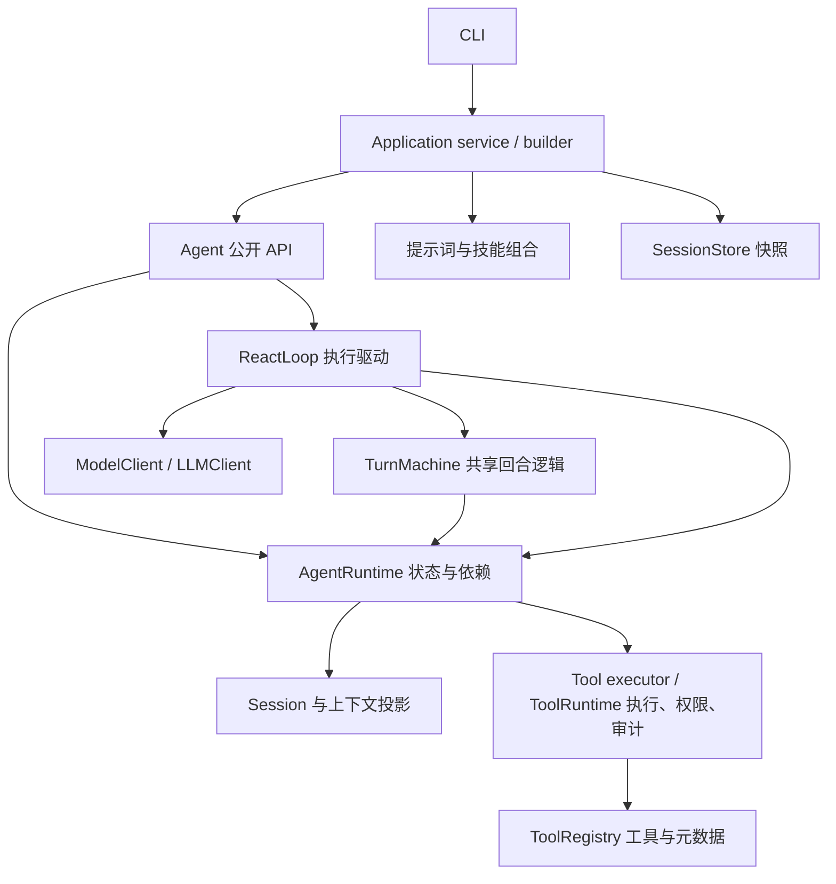

# Agent 模块职责与调优评估

For the current peer collaboration package and generic Agent worker boundary,
see [Group foundation](group-runtime.md). Its reception implementation separates
`group.reception` (durable sources), `group.member_context` (verified private
projection), `group.discovery` (strategy observation), and `group.execution` /
`group.lifecycle` / `group.service` (owned preparation and scheduling).
`core.context_batch` is generic and has no Group dependency. The assessment below
is historical.

> Historical assessment from September 23. The September 24 cleanup removed the
> prompt forwarding layers, simplified workspace registration, activated CLI
> logging, and repaired legacy serialization. See the current
> [cleanup and compatibility notes](agent-redundancy-cleanup-2026-09-24.md).

审阅日期：2026-09-23。初次审阅基线：`041c613`。
后续修复：`9a611a4` 与 `1806952`，已完成上下文裁剪、配置隔离和工具运行时注入。
下文保留问题原因及尚未实施的调优项，验证记录见[测试报告](testing-2026-09-23.md)。

当前的核心职责已经能分开理解。配置和工具执行状态的所有权已收紧；下一步仍可减少
提示词转发及内置工具注册层次。工具读取、记录保留和异常清理的后续修复见
[长时运行审计](reliability-2026-09-23.md)。共享回合逻辑、资源生命周期
和会话存储仍有独立保留的价值。

## 当前模块地图

| 责任域 | 主要文件 | 当前负责什么 | 评估 |
| --- | --- | --- | --- |
| 交互入口 | `main.py`、`cli/agent.py` | 命令、输入输出、流式展示、一个异步应用生命周期 | 保留薄入口 |
| 应用装配与生命周期 | `application/agent_config.py`、`agent_builder.py`、`agent_service.py` | 解析配置、创建组件、会话操作、快照、关闭自有模型 | 环境读取已集中，工具依赖完整注入 |
| Agent 执行 | `core/agent.py`、`core/agent_runtime/` | 公开 API、运行互斥、回合决策、执行驱动、事件、上下文投影 | 保留共享回合逻辑，精简无状态包装 |
| 会话与消息 | `core/session.py`、`session_store.py`、`models/` | 活跃上下文、有限历史、消息类型、版本化快照与校验 | 已按完整回合裁剪，保护当前任务 |
| 模型通信 | `core/llm.py`、`core/llm_runtime/` | OpenAI 兼容 HTTP/SSE、请求转换、错误与结束原因校验 | 统一响应边界可分阶段推进 |
| 提示词与技能 | `core/system_builder.py`、`prompting/`、`prompts/` | 提示词加载与顺序、工具说明、技能发现和组合 | 多层属性转发可合并 |
| 工具执行 | `tools/`，含 `workspace.py`、`file_io.py`、`process_io.py` | 声明、注册、调用、权限、审计、工作区、有界文件与进程 I/O | 状态所有权及资源边界已收紧；内置注册仍可简化 |
| 观测 | `core/usage.py`、`core/logger.py`、`observability/` | 用量记录、日志辅助、诊断格式化 | 补足流式指标，再评估性能 |

下图表示调用和状态协作关系，省略辅助函数；它不是严格的 Python import 图。



### 执行核心中应该保留的区分

| 组件 | 独立职责 |
| --- | --- |
| `Agent` | 对外方法、提示词与会话设置、受运行状态保护的更新 |
| `AgentRuntime` | 持有模型、会话、工具与选项，提供受保护的状态操作 |
| `AgentReactLoop` | 驱动同步/异步、流式/非流式 I/O，并处理流关闭和取消 |
| `AgentTurnMachine` | 决定何时请求模型、执行工具、继续或结束，维护未完成工具调用 |

四种执行方式共用回合逻辑，可以集中维护工具配对、异常终止和轮数上限的决策。
`Session` 管理内存状态，`JsonSessionStore` 管理版本化文件；二者的变化原因不同。
应用服务负责模型资源所有权与关闭，也不适合移入回合循环。

## 优先处理的行为问题

### 1. 上下文裁剪会丢失正在执行的任务（已修复）

位置：[Session.prune_active](../core/session.py) 与
[工具执行后的裁剪调用](../core/agent_runtime/turn_machine.py)。

旧算法先取固定长度的消息后缀，再删除失去对应调用的工具结果。最小复现：

```text
裁剪前：system → user（当前任务）→ assistant（两个工具调用）→ tool A → tool B
上限：3 条
修复前：system
修复后：system → user → assistant → tool A → tool B（允许超过软上限）
```

审阅时用真实 `Session` 与工具配对校验复现：历史仍有 5 条，活跃上下文只剩 1 条。
配对校验能够通过，但下一次模型调用已失去任务和工具结果。较大的上限也可能在较长的
工具链中丢掉最新用户需求；单纯增大默认值不能保证任务上下文完整。

现已按完整用户回合裁剪，保护当前用户任务及其全部工具调用/结果，追加新用户输入后再裁剪。
没有用户边界的消息序列完整保留。消息数量作为软上限；如果以后引入硬 token 预算，最小回合仍放不下时，应明确报错或
使用显式上下文压缩策略。历史记录的存储上限单独处理。

新增 14 个[裁剪回归用例](../tests/test_context_pruning.py)，覆盖小上限、多工具批次、
连续工具回合、无 system/无 user 消息、关闭裁剪，以及中断后工具配对。

### 2. 显式配置尚未形成完整隔离（已修复）

原先配置入口已有 `AgentAppConfig`，但以下组件仍读取进程环境：

- [LLMClient](../core/llm.py) 构造时调用 `get_config()`，空值回退到环境；
  [agent_builder](../application/agent_builder.py) 又把空字符串转成 `None`。
- [file_ops](../tools/file_ops.py) 在没有显式工作区时，每次从环境读取允许根目录。
- [PromptEnvironment](../prompting/runtime.py) 的技能目录初始化、文件读取上限及终端开关，
  也各有环境读取路径；应用装配会随后覆盖部分提示词配置。

审阅时用虚构的本地地址和凭据、禁用 `.env` 加载验证：`from_mapping({})` 创建的配置虽然
模型地址为空，`build_agent` 仍继承进程中的模型设置。另一个探针验证：不设置工作区的
同一个工具运行时，其允许目录会随后续 `MAS_WORKSPACE_ROOTS` 的变化而变化。没有发送模型请求。

现在环境只由应用配置入口解析；模型、提示词和工具组件接收明确值。`LLMClient.from_env()`
提供显式便捷入口，普通构造器不再继承环境中的地址或凭据。提示词默认技能目录为项目内路径。
`tools/workspace.py` 在创建时确定根目录、工作目录、文件读取字符上限和终端路径检查开关，
`ToolRuntime` 在执行时设置该实例的上下文。直接调用工具需用显式 `workspace_context`。

新增 11 个[配置隔离与注入用例](../tests/test_configuration_isolation.py)：显式配置不受环境污染，
创建后修改环境不改变已有实例，两个 Agent 的工具配置相互独立，替换 registry 保留权限和审计。

### 3. 工具输出截断发生在完整读取之后（已修复）

[terminal](../tools/builtin.py) 原先先完整收集 stdout/stderr，再截断到 20,000 字符；
[read_file](../tools/file_ops.py) 原先先读取和拼接行，再应用字符上限。
回归复现了双管道约 50 MiB、超长行约 16 MiB 的 Python 分配峰值。

现在终端使用持续排空的有界缓冲，超时和中断会清理自己的 POSIX 进程组。
文件读取按小块处理，包括跳过行和探测下一页；长行返回字符续读位置。
目录枚举、文件替换及通用工具结果保留也有明确上限。新增行为与分配峰值回归见
[工具测试](../tests/test_long_running_tools.py)，具体额度及平台限制见[配置](configuration.md)。

## 可以简化的结构

### 4. Tool execution ownership (completed September 24)

`AgentRuntime` owns the injected `ToolRuntime`. Registry
replacement preserves workspace, permission policy, caller, and audit routing.
The Agent mutation guard remains in place. `AgentToolExecutor` and
`AgentResponseParser` are lazy adapters used by execution so custom hooks remain
effective. The bound executor forwards runtime access to its owner, including
replacement; it does not retain a second runtime reference. The stateful stream
accumulator remains. See the [compatibility fixes](agent-compatibility-fixes-2026-09-24.md).

### 5. Prompt composition and built-in declarations (completed September 24)

`prompting.runtime.SystemBuilder` now owns prompt state and behavior.
`core.system_builder` is an import shim, and `PromptRuntime` is an alias. Separate
module-store/state forwarding objects were removed. The application and direct
builder calls share one default-loading policy, documented in
[configuration](configuration.md).

Workspace tools have one ordered declaration containing decorated callables and
permission metadata. The default binder registers them directly. Legacy query
and resolver helpers remain available, while string-based dynamic imports and
unregistered placeholder tools were removed. Registry, policy, audit, and
workspace isolation retain their separate responsibilities.

## 后续按需求推进的改进

| 项目 | 当前证据与建议 | 优先级 / 成本 |
| --- | --- | --- |
| 统一模型响应边界 | `ModelClient` 非流式返回供应商原始字典，流式返回本地 `Chunk`；Agent 内部还解析 `choices` 等字段。可让适配层统一返回本地消息与结束状态，保留底层原始响应 API（如仍有调用方）。仅服务 OpenAI 兼容端点时可延后。 | P3 / 中 |
| 明确工具结果类型 | 当前给通用 `Message` 动态添加 `tool_call_id`，再附带成功/停止标记。可增加明确的工具结果类型，分别定义传给模型、存储快照、执行控制所需字段；三种用途不应共用一个无差别序列化结果。 | P3 / 中 |
| 流式用量与耗时 | CLI 默认流式，但用量仅记录非流式返回。优先补模型耗时、工具耗时、流式供应商用量；供应商未提供时标记未知，不能算作零消耗。该流式限制已在操作文档记录。 | P3 / 中 |
| 同步连接复用 | 同步使用顶层 `httpx.post/stream`，异步复用 `AsyncClient`。若同步路径实际常用，再增加自有 `Client` 及关闭流程，测量连续工具回合的连接和延时。 | P3 / 小到中 |
| 上下文与事件复制成本 | 每次请求、上下文转换、事件交付有深复制。先测大工具输出、多监听器和长流场景；副本目前用于隔离外部修改，不能直接删除。 | P3 / 先测量 |

CLI startup now applies `MAS_LOG_LEVEL` to stderr logging without import-time
directory creation. Embedded application services leave logging to their host.
同步工具会阻塞异步驱动，当前属于已记录的限制；后台任务、线程卸载、并行工具需要单独定义
取消和副作用语义后再引入。

## 与参考项目对应的取舍

- [Pi 的固定版本 Agent 循环](https://github.com/earendil-works/pi/blob/898ab804050730e9dcefb4443875d5a932aa6a32/packages/agent/src/agent-loop.ts)
  将请求前上下文转换和模型消息转换分开。对本项目的启发是继续使用现有 `context_transform`
  边界，并让模型格式转换有明确归属。
- [OpenHands SDK 架构](https://docs.openhands.dev/sdk/arch/overview) 区分 Agent、Conversation、
  LLM、工具、Workspace 和外部应用。对本项目的启发是保留会话与应用生命周期边界，将工作区
  配置从具体文件工具中提取为可注入的数据；当前本地场景无需引入远程工作区实现。

以上是对职责边界的借鉴，并非要求复制它们的目录或全部功能。

## 建议实施顺序与本轮验证

1. 已完成上下文裁剪修复，并补对应行为回归。
2. 已完成统一配置解析和完整 ToolRuntime 注入，验证实例之间的配置隔离。
3. 合并提示词转发层、简化内置工具注册，保持公开行为及异常语义。
4. 已为工具读取和观测明细建立资源上限；流式用量和其他性能优化仍可按实际需求推进。
5. 需要更多供应商或更强类型约束时，再调整模型响应及工具结果契约。

本轮已将裁剪和配置探针转成回归用例，并实施上述两项修复。完整测试及独立审阅结果见
[测试报告](testing-2026-09-23.md)。后续可靠性修复补齐了工具读取资源上限和观测记录保留边界。

Group 和 Web 继续留在[独立归档](archive.md)。未来 Group 从 Agent 公开 API 和事件接入；
继承、插件或组合的具体形式仍可等到真实协作场景确定后再选。

另见[运行机制](agent-runtime.md)、[配置](configuration.md)和[操作说明](operations.md)。
